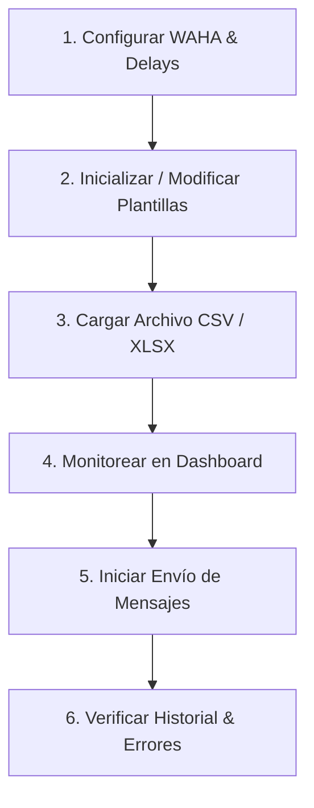

# 🧪 Guía de Pruebas de QA - WAHA Sender API

Esta guía te permitirá validar de forma ordenada el correcto funcionamiento del backend (.NET 8) y el motor de envío en segundo plano utilizando la documentación interactiva de **Swagger UI** (`http://localhost:5000/swagger`).

---

## 📋 Flujo de Pruebas Recomendado (Paso a Paso)

Para asegurar que todo funcione en armonía, realiza las pruebas en el siguiente orden lógico:



---

## 🛠️ Detalle de Endpoints y Datos de Prueba (JSON)

### Paso 1: Configuración (`/api/configuracion`)
Este endpoint configura el token de WAHA Docker, la URL de envío y las velocidades anti-spam.

*   **API a Probar:** `PUT /api/configuracion`
*   **Para qué sirve:** Define los parámetros globales del motor. El delay de seguridad evita bloqueos de WhatsApp.
*   **JSON de Prueba para Swagger:**
```json
{
  "delayMinSegundos": 5,
  "delayMaxSegundos": 15,
  "factorIncremento": 5,
  "wahaApiKey": "119ce04a85dd41818809be61aba87066",
  "wahaEndpointUrl": "http://localhost:3000/api/sendText",
  "wahaSession": "default"
}
```

---

### Paso 2: Plantillas de Mensajes (`/api/plantillas`)
El sistema cuenta con exactamente 8 plantillas. Deben tener contenido válido antes de importar contactos.

*   **API a Probar:** `PUT /api/plantillas/batch`
*   **Para qué sirve:** Guarda masivamente el texto que se enviará. Soporta la interpolación dinámica con `{Nombre}`.
*   **JSON de Prueba para Swagger:**
```json
[
  {
    "id": 1,
    "cuerpoTexto": "💰 ¡Hola {Nombre}! Tu crédito rápido ya está pre-aprobado. Solo necesitas tu DNI para retirar hoy.\n📲 Contacto: Betty Farroñan (995799743)",
    "activo": true
  },
  {
    "id": 2,
    "cuerpoTexto": "💰 Estimado/a {Nombre}, el Banco Santander tiene una oferta de préstamo a sola firma para ti.\n👉 Llama a Betty Farroñan al 995799743.",
    "activo": true
  },
  {
    "id": 3,
    "cuerpoTexto": "💳 ¡Buenas noticias {Nombre}! Tu tarjeta de crédito Santander ya está lista para entrega en sucursal.\n👩‍💼 Asesora: Betty (995799743)",
    "activo": true
  },
  {
    "id": 4,
    "cuerpoTexto": "💳 ¡Hola {Nombre}! Disfruta de compras sin intereses activando tu tarjeta Santander hoy.\n📲 Información al 995799743",
    "activo": true
  },
  {
    "id": 5,
    "cuerpoTexto": "👋 Hola {Nombre}, Betty Farroñan de Banco Santander te saluda. ¿Deseas recibir información de nuestras tarjetas?",
    "activo": true
  },
  {
    "id": 6,
    "cuerpoTexto": "💰 ¡Hola {Nombre}! Recuerda que puedes simular tu préstamo rápido hoy mismo.\n📲 Betty Farroñan: 995799743",
    "activo": true
  },
  {
    "id": 7,
    "cuerpoTexto": "💳 ¡Hola {Nombre}! Te damos la bienvenida a los beneficios exclusivos de tu tarjeta Santander.",
    "activo": true
  },
  {
    "id": 8,
    "cuerpoTexto": "👋 Estimado/a {Nombre}, gracias por tu preferencia. Consulta tus ofertas vigentes con tu asesora al 995799743.",
    "activo": true
  }
]
```

---

### Paso 3: Importación de Contactos (`/api/lotes`)
Carga masiva desde un archivo físico Excel `.xlsx` o texto `.csv`.

*   **API a Probar:** `POST /api/lotes/importar` (Usa el formato `multipart/form-data`)
*   **Parámetros:**
    *   `archivo`: El archivo `.csv` o `.xlsx` (abajo tienes el contenido para crearlo).
    *   `codigoPais`: `51` (o el código de país que desees prepender).
*   **Para qué sirve:** Carga la lista de contactos en la base de datos local SQLite y los encola en estado `Pendiente`.

#### 📄 Contenido para tu archivo de pruebas (`contactos_prueba.csv`):
Crea un archivo de texto con el nombre `contactos_prueba.csv` y pega este contenido exactamente para tus pruebas:
```csv
Numero,Nombre
995799743,Betty Farroñan
945430381,Jonathan QA
987654321,Cliente Ficticio 1
912345678,Cliente Ficticio 2
933333333,Cliente Ficticio 3
```

---

### Paso 4: Monitoreo y Métricas (`/api/dashboard`)
*   **API a Probar:** `GET /api/dashboard/metricas`
*   **Para qué sirve:** Retorna las tarjetas estadísticas de control en tiempo real (Enviados hoy, en cola, con error, estado de lote activo y modo de envío).

---

### Paso 5: Lanzar Envíos (Play / Pause)
Por arquitectura y seguridad, los mensajes **no se envían de forma automática e inmediata** al importar. El motor debe encenderse explícitamente.

*   **API a Probar:** `PUT /api/configuracion/toggle-envio`
*   **Para qué sirve:** Activa o pausa la ejecución en segundo plano (`BackgroundService`). Al activarlo, el motor buscará los registros `Pendientes`, aplicará los delays aleatorios y mandará los posts a WAHA Docker.

---

### Paso 6: Reintentar Errores
Si por algún motivo (p. ej. WAHA estuvo apagado) algunos envíos fallaron y quedaron en estado `Error`, puedes reencolarlos de un solo golpe.

*   **API a Probar:** `POST /api/lotes/reintentar-fallidos`
*   **Para qué sirve:** Convierte todos los registros individuales del lote actual en estado `Error` de nuevo a `Pendiente` para que el motor los vuelva a procesar.

---

## 📈 Casos de Prueba (QA Checkpoints)

| ID | Caso de Prueba | Acción en Swagger / UI | Resultado Esperado |
|---|---|---|---|
| **TC-01** | Cambiar límite diario de envíos | Ejecutar `PUT /api/configuracion/incrementar-limite` | El límite en `Configuracion` se incrementa según el factor (+5). |
| **TC-02** | Validación de números limpios | Importar un archivo con números que tengan espacios o caracteres como `+` o `-` | El backend los limpia y los guarda puramente numéricos (ej: `51995799743`). |
| **TC-03** | Interpolación aleatoria | Importar y revisar base de datos o historial | Cada número recibe una de las 8 plantillas activas de forma aleatoria, con el nombre correctamente insertado en `{Nombre}`. |
| **TC-04** | Pausa de motor activa | Con envíos pendientes, apagar el motor (`toggle-envio`) | El motor en segundo plano detiene los envíos inmediatamente; no se cambia de estado a ningún contacto. |
